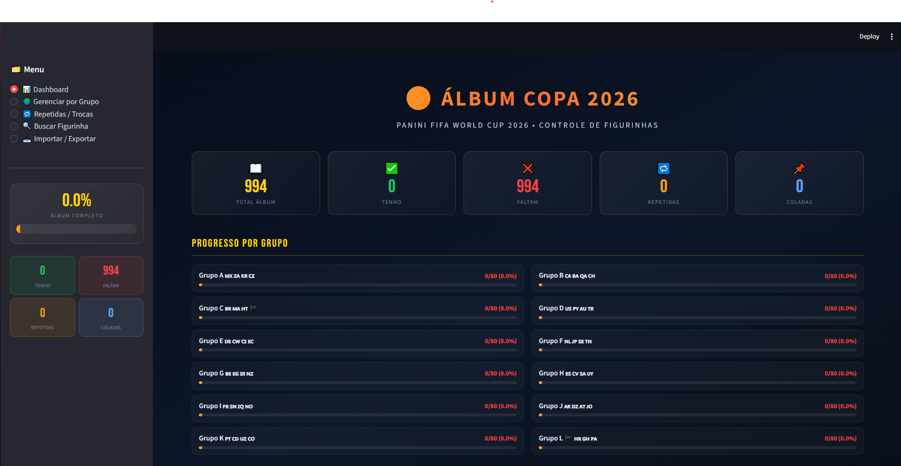

# ⚽ Álbum Copa 2026 — Controle de Figurinhas

> Aplicação web para controlar e gerenciar sua coleção de figurinhas do álbum **Panini FIFA World Cup 2026**, baseado na estrutura do [Ludopédio](https://ludopedio.org).


---

## 🖥️ Preview


> _Dashboard com progresso por grupo e seleção, gerenciamento por time, busca, repetidas e importação em lote._

---

## ✨ Funcionalidades

| Feature | Descrição |
|---|---|
| 📊 **Dashboard** | Visão geral com % de conclusão, progresso por grupo (A–L) e por seleção |
| 🌍 **Gerenciar por Grupo** | Navegue por grupo e seleção, marque figurinhas como **tenho**, **colada** ou **repetida** |
| 🔁 **Repetidas / Trocas** | Lista todas as repetidas agrupadas, com lista copiável para troca com amigos |
| 🔍 **Buscar** | Busca por código (ex: `BRA1`, `FWC5`) ou filtro por seleção e status |
| 📥 **Importar em Lote** | Cole uma lista de códigos para marcar várias figurinhas de uma vez |
| 📤 **Exportar CSV** | Exporte todo o estado do álbum em `.csv` |
| 🔄 **Reset** | Reinicie o progresso do álbum com confirmação de segurança |

---

## 🗂️ Estrutura do Álbum

- **Figurinha 00** — Introdução
- **FWC1–FWC19** — FIFA World Cup History
- **12 Grupos (A–L)** — 4 seleções por grupo × 20 figurinhas = **960 figurinhas**
- **CC1–CC14** — Coca-Cola

**Total: 974 figurinhas**

Grupos e seleções:

| Grupo | Seleções |
|---|---|
| A | 🇲🇽 México, 🇿🇦 África do Sul, 🇰🇷 Coreia do Sul, 🇨🇿 Rep. Tcheca |
| B | 🇨🇦 Canadá, 🇧🇦 Bósnia, 🇶🇦 Catar, 🇨🇭 Suíça |
| C | 🇧🇷 Brasil, 🇲🇦 Marrocos, 🇭🇹 Haiti, 🏴󠁧󠁢󠁳󠁣󠁴󠁿 Escócia |
| D | 🇺🇸 EUA, 🇵🇾 Paraguai, 🇦🇺 Austrália, 🇹🇷 Turquia |
| E | 🇩🇪 Alemanha, 🇨🇼 Curaçao, 🇨🇮 Costa do Marfim, 🇪🇨 Equador |
| F | 🇳🇱 Holanda, 🇯🇵 Japão, 🇸🇪 Suécia, 🇹🇳 Tunísia |
| G | 🇧🇪 Bélgica, 🇪🇬 Egito, 🇮🇷 Irã, 🇳🇿 Nova Zelândia |
| H | 🇪🇸 Espanha, 🇨🇻 Cabo Verde, 🇸🇦 Arábia Saudita, 🇺🇾 Uruguai |
| I | 🇫🇷 França, 🇸🇳 Senegal, 🇮🇶 Iraque, 🇳🇴 Noruega |
| J | 🇦🇷 Argentina, 🇩🇿 Argélia, 🇦🇹 Áustria, 🇯🇴 Jordânia |
| K | 🇵🇹 Portugal, 🇨🇩 Congo, 🇺🇿 Uzbequistão, 🇨🇴 Colômbia |
| L | 🏴󠁧󠁢󠁥󠁮󠁧󠁿 Inglaterra, 🇭🇷 Croácia, 🇬🇭 Gana, 🇵🇦 Panamá |

---

## 🚀 Como rodar localmente

### Pré-requisitos
- Python 3.10+
- pip

### Instalação

```bash
# Clone o repositório
git clone https://github.com/seu-usuario/album-copa-2026.git
cd album-copa-2026

# Instale as dependências
pip install -r requirements.txt

# Rode a aplicação
streamlit run figurinhas_copa2026.py
```

A aplicação abre em `http://localhost:8501`.  
O banco de dados SQLite (`figurinhas_copa2026.db`) é criado automaticamente na primeira execução.

---

## 🛠️ Stack

- **[Streamlit](https://streamlit.io/)** — Interface web
- **SQLite** — Banco de dados local (arquivo `.db`)
- **Pandas** — Manipulação dos dados
- **Python** — Backend

---

## 📁 Estrutura de arquivos

```
album-copa-2026/
├── figurinhas_copa2026.py   # App principal
├── requirements.txt         # Dependências
├── README.md                # Este arquivo
├── .gitignore               # Ignora o .db e arquivos temporários
└── figurinhas_copa2026.db   # Gerado automaticamente (não commitado)
```

---

## 🤝 Contribuindo

Pull requests são bem-vindos! Para mudanças maiores, abra uma issue primeiro.

---

## 📄 Licença

MIT — sinta-se à vontade para usar, modificar e distribuir.

---

_Feito com ⚽ e ☕ para fãs do álbum Panini Copa 2026_
